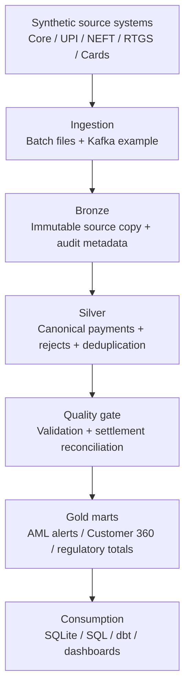

# Architecture

## Design goals

The portfolio implementation separates source contracts, immutable ingestion,
canonical transformations, quality controls, and consumer-ready marts. The
default local path proves the business logic without requiring cloud spending;
the Kafka, Spark, Airflow, dbt, Docker, and Terraform assets show how the same
boundaries extend to an enterprise deployment.

## Source contracts

| Source | Format | Pattern | Key distinction |
|---|---|---|---|
| Simulated core banking | CSV | Daily extract | Customer and account master |
| Simulated UPI | JSONL/Kafka | Event | Payer/payee and device fields |
| Simulated NEFT | CSV | Batch | UTR and settlement batch |
| Simulated RTGS | CSV | Micro-batch | Bank and settlement timestamps |
| Simulated cards | JSONL/Kafka | Event | Authorization and response code |
| Synthetic AML labels | CSV | Batch | Training/evaluation hints only |
| Settlement system | CSV | Batch | Independent amount/status control |

The schemas differ on purpose. Standardization is meaningful only when source
contracts are genuinely independent.

## Canonical model

The Silver payment contract is keyed by `(source_system, payment_id)` and
includes source/destination accounts, customer, channel, amount/currency,
event/status fields, and audit metadata. Invalid records go to a reject output;
duplicates are removed deterministically.

## Data quality and reconciliation

The local pipeline enforces four gates:

1. required identifiers, positive amounts, and parseable timestamps;
2. idempotent source-and-payment deduplication;
3. settlement presence and exact-amount matching for successful payments;
4. configurable reject, duplicate, and missing-settlement thresholds.

The generated data deliberately contains exceptions so that these controls can
be demonstrated rather than described abstractly.

## Security and governance notes

- All default records are synthetic and labeled as such.
- Account numbers are artificial IDs; there is no real PII or PCI data.
- Production deployment should use secret storage, TLS/SASL for Kafka,
  least-privilege IAM/RBAC, encryption, column masking, lineage, and retention.
- The Terraform example blocks public access and enables versioning/encryption.
- Source file and ingestion timestamp provide basic audit traceability.

## Production scaling path

| Local proof | Production equivalent |
|---|---|
| CSV/JSONL | Object storage and governed source zones |
| SQLite | Snowflake/Databricks SQL warehouse |
| Python canonicalizer | Spark Structured Streaming / PySpark jobs |
| Makefile | Airflow DAG and CI/CD |
| JSON quality report | Observability metrics, SLA alerts, incident routing |
| Local config | Environment-specific configuration and secret manager |

The repository does not claim that the local demo reproduces a bank's exact
deployment topology, scale, controls, or internal source schemas.
